# Employee Management CLI Application

This is a CLI-based Employee Management System built with Dart. The application allows users to manage employee information, including adding, updating, deleting, and viewing employee details.


## Installation

1. Ensure you have Dart installed on your system. If not, you can download it from [Dart's official website](https://dart.dev/get-dart).
2. Clone this repository:
    ```bash
    git clone https://github.com/turki-aloufi/employees.git
    ```
3. Navigate to the project directory:
    ```bash
    cd employees_manager
    ```

## Usage

1. Run the application:
    ```bash
    dart run
    ```
2. Follow the on-screen instructions to interact with the CLI.

## Features

- **Print My Info**: Display the information of the logged-in employee.
- **Add a New Employee**: Add a new employee to the system.
- **Delete an Existing Employee**: Remove an employee from the system.
- **Update Employee Info**: Update details of an existing employee.
- **Print Employee by ID**: Display information of a specific employee by their ID.
- **Print All Employees**: List all employees in the system.

## System preview

### Welcome Screen and Login
Once the system starts, a welcoming message will be displayed, and the user will be prompted to log in using his ID.

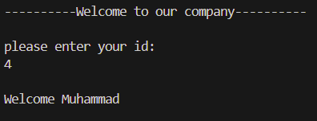

### Main Menu
If the user has logged in successfully, the following main menu will appear.

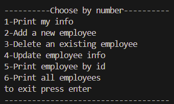

### Print my info
If the user pressed 1, the system will print his info in the following format.

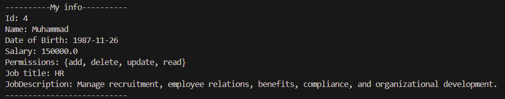

### Add Employee
If the user pressed 2 and he has the permission "add", the system will prompt him to enter employee data as following, and then add the new employee to the system.

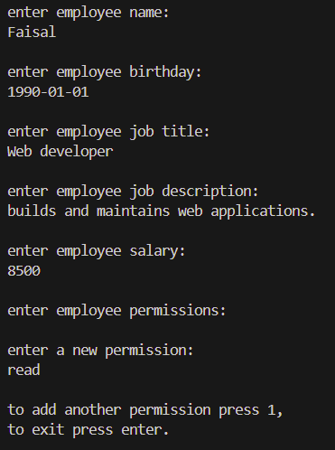

### Print all Employees
If the user pressed 6 and he has the permission "read", the system will print all employees data.

Notice that the last employee is the one we have just added.


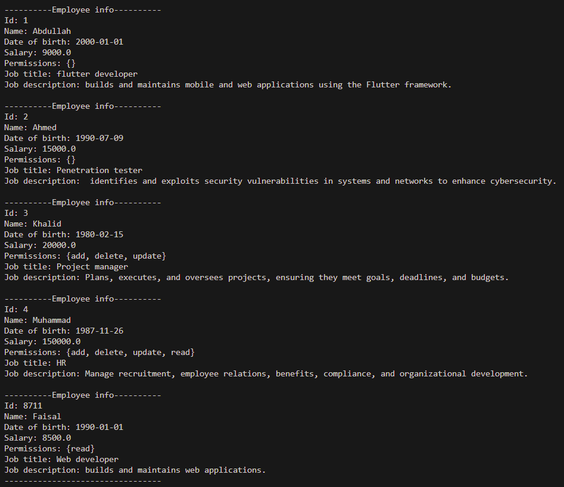

### Update Employee
If the user pressed 4 and he has the permission "update", the system will allow him to update salary, permissions and job description.
let's test updating faisal's info.

1. Update salary.

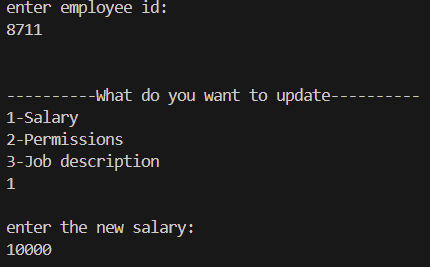

2. Add a new permission.

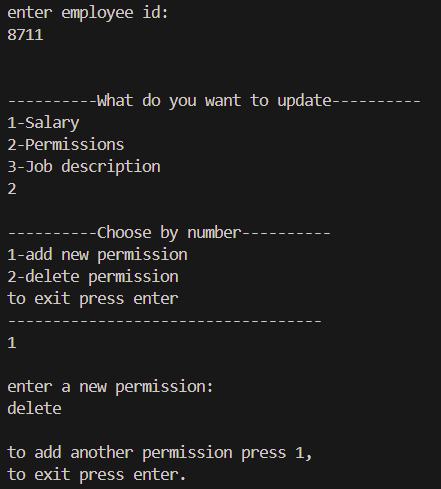

3. Delete permission.

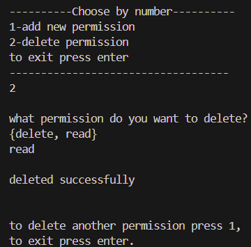

4. Update job description.

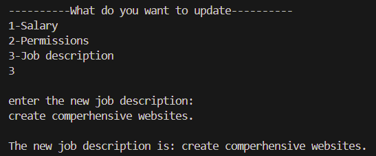

### Print employee by id
If the user pressed 5 and he has the permission "read", the system will print the employee which his id was entered.

Notice that his info is updated.

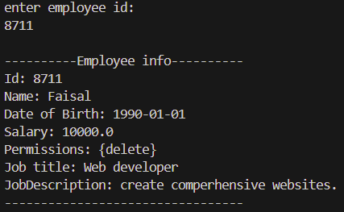

### Delete Employee
If the user pressed 5 and he has the permission "delete", the system will prompt him to to delete employee by entering his id.

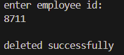


